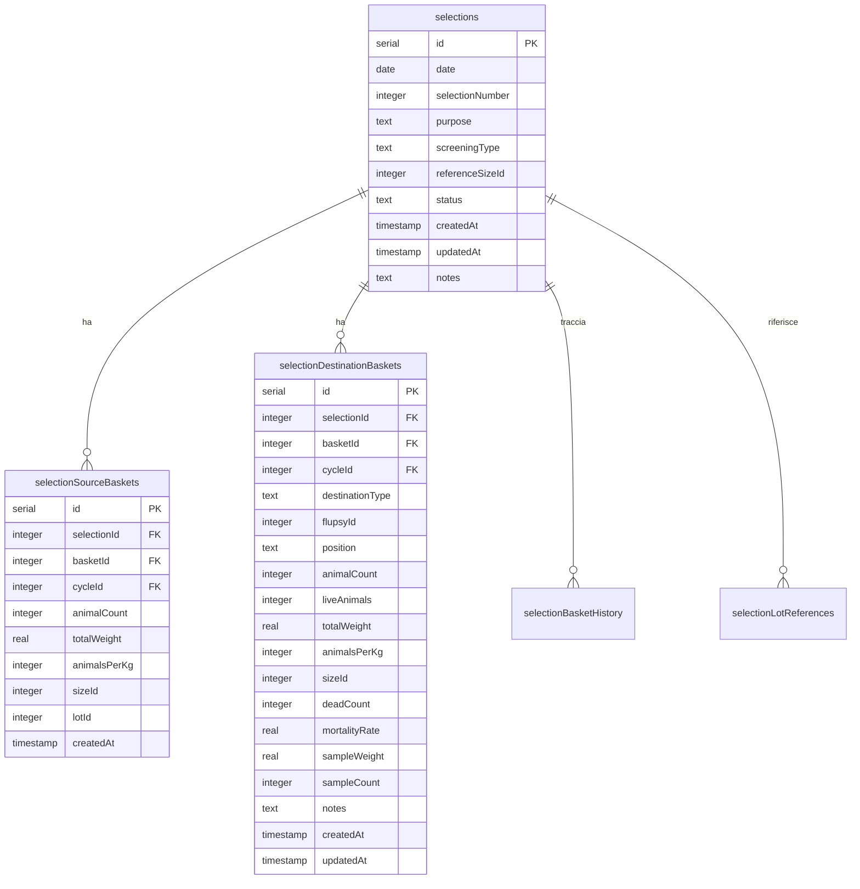

# Documentazione: Vagliatura con Mappa

## Panoramica Generale

Il modulo **Vagliatura con Mappa** è un sistema avanzato per la gestione delle operazioni di vagliatura (screening) che utilizza una rappresentazione visuale dei FLUPSY e dei cestelli per facilitare il processo di selezione, posizionamento e vendita dei prodotti dell'acquacoltura.

## Architettura del Sistema

### 1. Componenti Frontend

#### Componente Principale: `VagliaturaConMappa.tsx`
- **Ruolo**: Interfaccia utente principale per la gestione della vagliatura
- **Funzionalità**:
  - Selezione cestelli di origine
  - Configurazione cestelli di destinazione  
  - Calcoli automatici (animali/kg, mortalità, taglie)
  - Visualizzazione mappa FLUPSY
  - Gestione vendite dirette

#### Componente Mappa: `FlupsyMapVisualizer.tsx`
- **Ruolo**: Visualizzazione interattiva dei FLUPSY e delle posizioni
- **Funzionalità**:
  - Rappresentazione grafica delle ceste
  - Drag & drop per posizionamento
  - Indicatori di stato e disponibilità

### 2. Componenti Backend

#### Controller Screening: `screening-controller.ts`
- **Funzioni principali**:
  - `prepareScreeningOperation()` - Preparazione e preview
  - `executeScreeningOperation()` - Esecuzione operazione
  - `determineSizeId()` - Calcolo automatico taglie
  - `findAvailablePositions()` - Ricerca posizioni disponibili

#### Controller Selezioni: `selection-controller.ts`
- **Funzioni principali**:
  - `createSelection()` - Creazione nuova selezione
  - `getAvailableBaskets()` - Cestelli disponibili
  - `getAvailablePositions()` - Posizioni disponibili
  - `completeSelection()` - Completamento selezione

## Schema Database

### Tabelle Principali



## Flusso Operativo

### Fase 1: Creazione Selezione
```
1. Utente avvia nuova operazione
   ↓
2. Sistema crea record in tabella `selections`
   - status: 'draft'
   - selectionNumber: auto-incrementato
   - date: data corrente
   ↓
3. Ritorna ID selezione per fasi successive
```

### Fase 2: Selezione Cestelli Origine
```
1. Sistema recupera cestelli disponibili
   ↓
2. Utente seleziona cestelli origine
   ↓
3. Per ogni cestello selezionato:
   - Crea record in `selectionSourceBaskets`
   - Cattura dati attuali (animalCount, totalWeight, etc.)
   ↓
4. Calcoli automatici:
   - Totale animali
   - Media animali/kg (ponderata)
   - Determinazione taglia di riferimento
```

### Fase 3: Configurazione Destinazioni
```
1. Sistema suggerisce posizioni disponibili
   ↓
2. Utente configura cestelli destinazione:
   - Posizionamento (flupsyId + position)
   - Vendita diretta (destinationType: 'sold')
   ↓
3. Per posizionamento:
   - Dati misurazione (sampleWeight, sampleCount, deadCount)
   - Calcoli automatici (animalsPerKg, mortalityRate)
   ↓
4. Crea record in `selectionDestinationBaskets`
```

### Fase 4: Completamento Operazione
```
1. Validazione dati completi
   ↓
2. Transazione database:
   - Aggiorna status selezione → 'completed'
   - Aggiorna cestelli origine (libera da cicli)
   - Aggiorna cestelli destinazione (assegna cicli/posizioni)
   - Crea record `selectionBasketHistory`
   - Chiude `basketPositionHistory` vecchie posizioni
   - Crea nuove `basketPositionHistory`
   ↓
3. Notifiche WebSocket
   ↓
4. Cache invalidation
```

## Operazioni a Livello Database

### Record Singolo - Esempio Selezione

#### 1. Tabella `selections`
```sql
INSERT INTO selections (
  date, selectionNumber, purpose, screeningType, 
  referenceSizeId, status, notes
) VALUES (
  '2025-08-23', 15, 'vagliatura', 'sopra_vaglio',
  18, 'completed', 'Vagliatura taglia TP-2800'
);
```

#### 2. Tabella `selectionSourceBaskets` (per ogni cestello origine)
```sql
INSERT INTO selectionSourceBaskets (
  selectionId, basketId, cycleId, animalCount,
  totalWeight, animalsPerKg, sizeId, lotId
) VALUES (
  15, 2, 1, 2500000,
  72500, 34483, 18, 3
);
```

#### 3. Tabella `selectionDestinationBaskets` (per ogni destinazione)
```sql
INSERT INTO selectionDestinationBaskets (
  selectionId, basketId, destinationType, flupsyId, position,
  animalCount, liveAnimals, totalWeight, animalsPerKg,
  sizeId, deadCount, mortalityRate, sampleWeight, sampleCount
) VALUES (
  15, 5, 'placed', 570, 'DX-3',
  1200000, 1150000, 35000, 34000,
  18, 50, 4.2, 100, 500
);
```

#### 4. Aggiornamento `baskets` (cestello origine liberato)
```sql
UPDATE baskets SET 
  currentCycleId = NULL,
  row = NULL,
  position = NULL
WHERE id = 2;
```

#### 5. Aggiornamento `baskets` (cestello destinazione posizionato)
```sql
UPDATE baskets SET 
  currentCycleId = 1,
  flupsyId = 570,
  row = 'DX',
  position = 3
WHERE id = 5;
```

#### 6. Storico posizioni `basketPositionHistory`
```sql
-- Chiude posizione precedente
UPDATE basketPositionHistory 
SET endDate = '2025-08-23'
WHERE basketId = 2 AND endDate IS NULL;

-- Crea nuova posizione
INSERT INTO basketPositionHistory (
  basketId, flupsyId, row, position, startDate
) VALUES (
  5, 570, 'DX', 3, '2025-08-23'
);
```

## Calcoli Automatici

### 1. Animali per Kg
```javascript
animalsPerKg = Math.round((sampleCount / sampleWeight) * 1000);
```

### 2. Mortalità
```javascript
const totalSampleAnimals = sampleCount + deadCount;
mortalityRate = Math.round((deadCount / totalSampleAnimals) * 100);
```

### 3. Animali Vivi Totali
```javascript
const totalTheoretical = Math.round(totalWeight * animalsPerKg);
const mortalityFactor = mortalityRate / 100;
animalCount = Math.round(totalTheoretical * (1 - mortalityFactor));
```

### 4. Determinazione Taglia Automatica
```javascript
function determineSizeId(animalsPerKg) {
  const matchingSize = sizes.find(size => 
    animalsPerKg >= size.minAnimalsPerKg && 
    animalsPerKg <= size.maxAnimalsPerKg
  );
  return matchingSize?.id || null;
}
```

## Funzionalità Principali

### 1. **Selezione Cestelli Origine**
- Visualizzazione cestelli attivi con dati ultima operazione
- Selezione multipla con aggregazione automatica valori
- Calcolo taglia di riferimento media ponderata
- Ordinamento intelligente per performance

### 2. **Configurazione Destinazioni**
- **Posizionamento**: Assegnazione posizione specifica in FLUPSY
- **Vendita Diretta**: Configurazione per vendita immediata
- Misurazione campione con calcoli automatici
- Validazione disponibilità posizioni

### 3. **Calcoli e Validazioni**
- Calcolo automatico animali/kg da campione
- Calcolo tasso mortalità da conteggio morti/vivi
- Determinazione automatica taglie da animali/kg
- Validazione coerenza dati inseriti

### 4. **Mappa Interattiva**
- Visualizzazione grafica FLUPSY e posizioni
- Indicatori colorati per stato cestelli
- Drag & drop per assegnazione posizioni
- Filtri per FLUPSY e stato

### 5. **Gestione Transazioni**
- Operazioni atomiche con rollback automatico
- Validazione integrità referenziale
- Gestione concorrenza su posizioni
- Audit trail completo

## Stati del Sistema

### Stati Selezione
- **`draft`**: Selezione in corso di configurazione
- **`completed`**: Selezione completata con successo  
- **`cancelled`**: Selezione annullata

### Stati Cestello
- **`available`**: Cestello libero per nuovi cicli
- **`active`**: Cestello con ciclo attivo in corso

### Tipi Destinazione
- **`placed`**: Cestello posizionato in FLUPSY specifico
- **`sold`**: Cestello venduto direttamente

## API Endpoints

### Selezioni
- `GET /api/selections` - Lista selezioni
- `POST /api/selections` - Crea nuova selezione
- `GET /api/selections/:id` - Dettagli selezione
- `POST /api/selections/:id/complete` - Completa selezione

### Screening
- `POST /api/screening/prepare` - Prepara operazione (preview)
- `POST /api/screening/execute` - Esegue operazione

### Utilità
- `GET /api/selections/available-baskets` - Cestelli disponibili
- `GET /api/selections/available-positions/:flupsyId` - Posizioni disponibili

## Notifiche e WebSocket

### Eventi WebSocket
- `selection_created` - Nuova selezione creata
- `operation_completed` - Operazione completata
- `new_notification` - Nuova notifica sistema

### Tipi Notifica
- `vagliatura-origine` - Notifiche cestelli origine
- `vagliatura-destinazione` - Notifiche cestelli destinazione

## Ottimizzazioni e Cache

### Cache Implementate
- **Posizioni disponibili**: TTL 2 minuti
- **Cestelli disponibili**: TTL 10 minuti  
- **Query operazioni**: TTL configurabile

### Strategie Performance
- Query ottimizzate con JOIN minimali
- Caricamento lazy componenti pesanti
- Invalidazione cache selettiva
- Paginazione risultati grandi

## Sicurezza e Validazione

### Validazioni Dati
- Controllo esistenza cestelli referenziati
- Validazione disponibilità posizioni
- Controllo coerenza stati cestelli
- Validazione range numerici

### Controlli Transazionali
- Verifica concurrent access su posizioni
- Rollback automatico su errori
- Lock pessimistici per operazioni critiche
- Audit log modifiche

## Integrazione con Altri Moduli

### Dipendenze
- **Modulo Cestelli**: Gestione stato e posizioni
- **Modulo Cicli**: Creazione e chiusura cicli
- **Modulo Operazioni**: Registrazione operazioni
- **Modulo Taglie**: Determinazione automatica taglie
- **Modulo Notifiche**: Comunicazioni sistema

### Effetti Collaterali
- Invalidazione cache moduli dipendenti
- Trigger notifiche a operatori
- Aggiornamento dashboard real-time
- Sincronizzazione sistemi esterni

---

*Documento generato il 23 Agosto 2025 - Sistema FLUPSY Management v1.0*